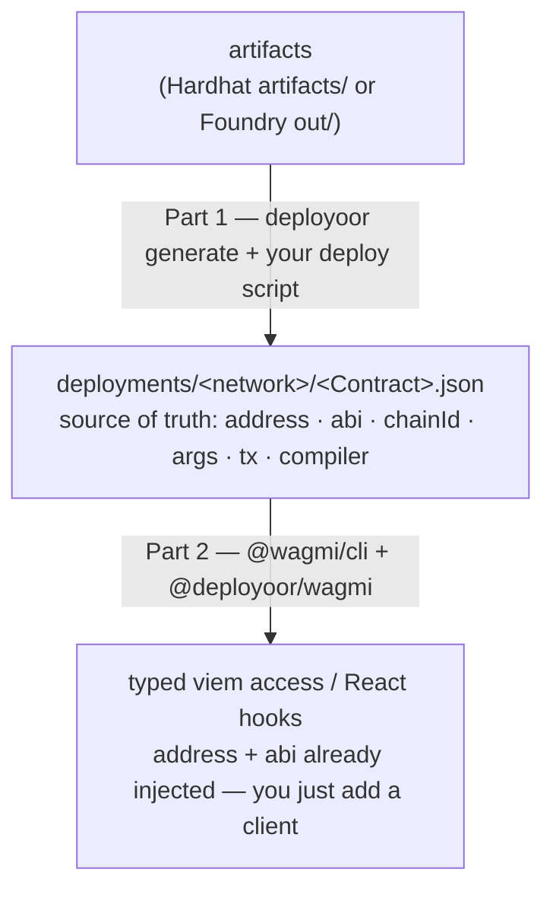

<div align="center">

# deployoor

**viem-first smart-contract deployment. Deploy once, use your contracts as typed objects.**

The generated code depends only on `viem` — never on deployoor. Works with Hardhat and Foundry.

</div>

---

## The problem

Deploying contracts to an EVM chain is solved. _Using_ them from your app is where it falls apart.

- **Addresses and ABIs get copy-pasted and go stale.** The address ends up in a deploy script, the ABI in some JSON file, and you paste both into your app by hand. Redeploy, and every copy silently drifts out of sync.
- **Provider/client wiring is manual boilerplate.** You re-thread the same client, address, and ABI into every contract, on every network.
- **There's no single source of truth** for what is deployed where — with which ABI, constructor args, tx hash, and compiler — across networks.
- **Deploy scripts aren't idempotent.** Re-running either redeploys or throws, when all you wanted was the contract you already deployed.
- **Tools couple your app to themselves.** You want generated code that depends only on `viem`, so you can drop the tool later with zero lock-in.

## The fix

deployoor makes a plain `deployments/` folder the single source of truth, and generates the wiring for you:

- Every deploy is recorded to `deployments/<network>/<Contract>.json` — address, ABI, chainId, args, tx, compiler. No copy-paste, no drift.
- Generated deployers inject the address and ABI for you. You add a client; nothing else.
- `getOrDeploy<Name>` is **idempotent**: first call deploys and records; later calls return the existing contract with no tx; `force: true` redeploys; `register(...)` records an external contract (e.g. USDC) with no tx.
- The code you ship depends only on `viem`. Delete deployoor and your app keeps working.

The name is the crypto-degen `-oor` agent-noun of "deploy" (like buidloor / hodloor) — literally "the thing that deploys."

## How it works

Two parts, with a plain `deployments/` folder as the stable contract between them. deployoor owns Part 1 (deploy + the `deployments/` record + lifecycle hooks). Part 2 delegates to `@wagmi/cli` — it doesn't reinvent consumption codegen, it feeds it.



## Quickstart

```bash
npx deployoor init && npx deployoor generate
```

```ts
// deploy once; every run after this returns the same contract
const token = await getOrDeployToken({ walletClient, publicClient, args: [owner] });
await token.write.transfer([to, amount]);
```

`deployoor generate` reads your artifacts and emits one typed `getOrDeploy<Name>` per contract. Config lives in `deployoor.config.ts`. Plugins are deploy-lifecycle hooks authored against the `deployoor/plugin` SDK.

## Packages

| Package                                                | Description                                                                                                                                                                 |
| ------------------------------------------------------ | --------------------------------------------------------------------------------------------------------------------------------------------------------------------------- |
| [`deployoor`](packages/deployoor)                      | The deploy engine + codegen + CLI (`deployoor generate` / `deployoor init`). Reads Hardhat/Foundry artifacts, emits typed deployers, records each deploy to `deployments/`. |
| [`@deployoor/wagmi`](packages/deployoor-wagmi)         | A [`@wagmi/cli`](https://wagmi.sh/cli) plugin sourcing contracts from `deployments/` — typed contract objects for your app.                                                 |
| [`@deployoor/etherscan`](packages/deployoor-etherscan) | Verify on Etherscan V2 (one key, all chains; also Blockscout/Routescan).                                                                                                    |
| [`@deployoor/sourcify`](packages/deployoor-sourcify)   | Verify on Sourcify (v2, keyless).                                                                                                                                           |
| [`@deployoor/slack`](packages/deployoor-slack)         | Notify a Slack channel on each deploy.                                                                                                                                      |

Plugins are deploy-lifecycle hooks; each ships as its own package and depends only on `deployoor/plugin`.

## Development

This is a pnpm + Turborepo monorepo.

```bash
pnpm install      # install everything
pnpm build        # build all packages (turbo)
pnpm test         # run all tests
pnpm typecheck    # typecheck all packages
pnpm lint         # oxlint
pnpm format       # prettier --write
```

Releases are managed with [Changesets](https://github.com/changesets/changesets): add one with `pnpm changeset`; merging the auto-opened "Version Packages" PR publishes to npm with provenance.

## Status

Early. The deploy core, the plugin model, and the wagmi bridge are stabilizing. Hardhat v2 is supported today; a Hardhat v3 port will follow if adoption warrants it.

## License

[MIT](LICENSE) © Valerio Leo
