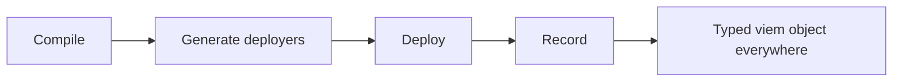

# Introduction

**Deploy contracts from TypeScript. Bring your own wallet.**

A deploy is an artifact plus a viem wallet, so deploy scripts are ordinary Node programs, tests call the same functions, and every chain is a client you construct.

## Why we built this

deployoor started with a few questions we kept failing to answer while using other tools.

- **If deploying or interacting with a contract is really just a wallet and some bytecode, why does a whole [Hardhat](https://hardhat.org) environment have to be running for it?**   Testing a contract, deploying it, and later reading a value off it are separate jobs at separate points in a project's life, and all three go through the same runtime.

- **Why are we still passing private keys around in `.env` files?**   A raw key in a `.env` file is a shared company credential: no audit trail, no per-person scope, and no way to revoke one laptop without rotating for everybody. It is easy to wave that through because it is only staging, and that is where the second problem starts. Staging ends up as a bare EOA that someone has to keep topping up with gas, while production signs with a Safe or a key in AWS KMS. The two environments no longer sign the same way, so the path you rehearse is not the path you ship. Using one signing method across both removes that drift, and [Privy](https://privy.io), [Turnkey](https://www.turnkey.com), [Dfns](https://dfns.co) and [Openfort](https://www.openfort.io) make it practical: the key stays on their side, access is granted per person or per service, spending policies are enforced for you, and sponsored gas or account abstraction takes the funding chore away.

- **Why does multichain still feel like an edge case?**   Shipping the same contracts to several chains is ordinary Ethereum development now, but the tooling still treats one chain as the default and every chain after it as a special arrangement. Same contract, same arguments, fifteen chains: it should be a loop over an array.

- **And why is the deploy script we trust with real money not the one our tests actually run?**   Tests deploy through the framework's own helper, while production runs a script somebody wrote by hand. They drift apart, and the version carrying the money is the one with less practice.

They all come from one thing: a framework that owns the deploy step ends up owning your wallet and your network list too. Signing becomes a config file the framework reads, so a signer it has no plugin for is a signer you cannot use.

So deployoor leaves compiling and node-running to Hardhat and [Foundry](https://getfoundry.sh), and gives the wallet layer back to you. [viem](https://viem.sh) makes that handoff easy, because a wallet is already a plain object there: a local key, an encrypted keystore, cloud KMS, any of the services above, a [Ledger](https://www.ledger.com), or a JSON-RPC account where no key ever enters your process.

What a deploy actually needs turns out to be small: **a viem wallet and some bytecode**. Deploying is then a function call, and the same deploy function runs in a unit test, in the script that stands up a protocol holding real money, and in the throwaway script you write three months later. It hands back an ordinary typed viem object, so [your tests](/guides/testing) and [your frontend](/guides/consumption) describe the contract with the same types and cannot drift apart without the compiler saying so.

Every deploy is recorded per chain as plain JSON, so calling the function again returns the recorded contract instead of deploying a second one. [Hooks](/guides/plugins) cover the rest: verify on Etherscan, write an address book, post to your engineering channel when the Sepolia stack moves under someone's feet.

deployoor is a library rather than a runtime. We think it changes how you work with contracts across their whole life, not only on the day you deploy them.

import { WalletStrip } from "../components/WalletStrip";

<WalletStrip />

## Who this is for

TypeScript and JavaScript teams. deployoor generates functions you call from `.ts`, and its output is consumed by [`viem`](https://viem.sh) and [`@wagmi/cli`](https://wagmi.sh/cli), so it earns its place when the code around your contracts is TypeScript.

That is also why it reads Foundry artifacts. A Foundry-native project already has excellent Solidity tests and no good way to drive its contracts from TypeScript. Point deployoor at `out/` and you keep `forge build` and `forge test`, and additionally get typed deploy scripts and TS integration tests over the same artifacts, with no Hardhat required. Hardhat v2 and v3 work the same way, and plain `.sol` can be compiled directly with [tevm](https://tevm.sh).

## How it works

1. **Compile** with Hardhat (v2 or v3) or Foundry. deployoor reads your artifacts (or point it at plain `.sol` and it compiles them with tevm).
2. **Generate** typed `getOrDeploy<Name>` functions into `./deployers/`.
3. **Deploy** with a plain TypeScript script. Each run records to `deployments/<chainId>-<network>/`.
4. **Use** the result immediately: every `getOrDeploy` call returns a **typed viem contract object** (`contract.read.*`, `contract.write.*`) in deploy scripts, in your app via [`@wagmi/cli`](/guides/consumption), and in tests via [`@deployoor/testing`](/guides/testing).
