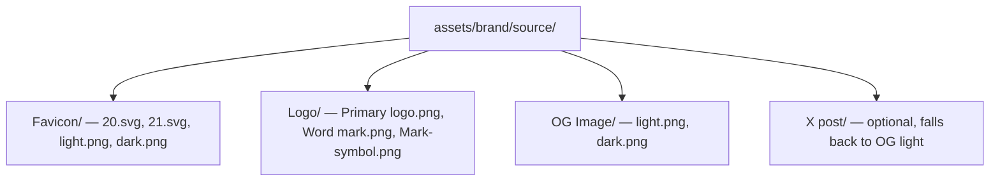

# Brand assets

Drop source files under `assets/brand/source/`, then run:

```bash
pnpm brand:assets
```

## Current layout (from design export)



The processor picks the largest raster or first SVG in each folder. Name light/dark logo variants with `light` / `dark` in the filename when you have both.

## Generated outputs

Written to `apps/docs/public/` (and mirrored under `assets/brand/dist/`):

| File                      | Size     | Use                             |
| ------------------------- | -------- | ------------------------------- |
| `favicon.svg`             | vector   | Modern browsers, Vocs `iconUrl` |
| `favicon.ico`             | 16+32    | Legacy browsers                 |
| `favicon-16x16.png`       | 16×16    | Tab icon                        |
| `favicon-32x32.png`       | 32×32    | Tab icon                        |
| `apple-touch-icon.png`    | 180×180  | iOS home screen                 |
| `icon-192.png`            | 192×192  | PWA manifest                    |
| `icon-512.png`            | 512×512  | PWA manifest                    |
| `logo-light.svg` / `.png` | —        | Docs nav (light mode)           |
| `logo-dark.svg` / `.png`  | —        | Docs nav (dark mode)            |
| `og.png`                  | 1200×630 | Open Graph / Twitter large card |
| `x-card.png`              | 1200×675 | X summary card                  |
| `site.webmanifest`        | —        | PWA metadata                    |

Also copies `og.png` → repo root `assets/brand/dist/` for GitHub/npm reuse.

## First-time setup

Copy from your machine (paths with spaces quoted):

```bash
mkdir -p assets/brand/source
cp -R ~/Downloads/Deployoor\ assets/* assets/brand/source/
pnpm brand:assets
```

Requires `sharp` (installed with the monorepo). Optional: [VHS](https://github.com/charmbracelet/vhs) for the README terminal demo (`pnpm demo:record`).
